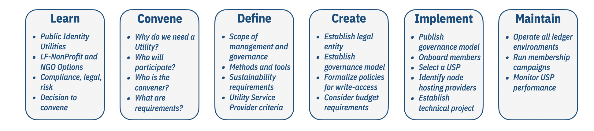

## Utility Case Study

| Story Name | Case Study Type |
| --- | --- |
| Indicio Network | Actual|

### Background Context
Indicio.tech was created to fill a need in the SSI community. Indicio's mission is to provide the professional services needed to build decentralized identity products. Several of Indicio's customers voiced their desire to have a new Indy-based network that had the following characteristics: 

* Build SSI solutions on a professinally run and maintained network.
* Simplified governance. Governance doesn't have to be hard to read and understand.
* Maintain financial sustainability through Node Operator support.
* Diversified Node Operators, with each Node Operator having a significant voice in network governance and administration.
* Require adherence open standards and protocols.
* Public write access via ledger payments.

So Indicio created the Indicio Network: a concierge-class network, offering expert support to design, build, and test decentralized identity products, networks, and solutions. They started by building a TestNet and will follow up with a production network (Indicio MainNet), then a demonstration network (Indicio DemoNet).

### Pertinent Concepts
* Self-sustained: Leveraging lessons learned from the [Sovrin Foundation](http://sovrin.org), a business model that finacially supports the network infrastructure must be established.
* Governance: Bring design thinking to governance so that the UI and UX of governing is simple, clear, and strong.
* Professionally maintained: Open source tools must be used by experienced staff to instantiate and run each of the Indicio networks.
 
### Stakeholders / Persona
The following subjects are participants in the story:

* Lynn (Technologist): Network Operations expert.
* Indicio Team (Staff): Digital Identity experts, many of them former Sovrin employees.
* Node Operators (Stewards): Companies in contact with Indicio that are interested in starting a new network.

### User Stories
1. Shortly after being formed by former Sovrin employees with other industry experts, Indicio begins talking to companies interested in having SSI experts help them with their needs. 
2. Several of these companies express an interest in having Indicio provide a public network offering.
3. Indicio executives approve the idea of building an Indicio network and begin the process of planning and preparing for the governance and maintenance of it.
4. The services of Lynn, an experienced Indy Network operator, are obtained, first as a contract employee and then later as a full-time employee. 
5. Steward recruitment and governance work begins in earnest as the need for an Indicio network becomes more urgent.
6. Lynn writes documents detailing the steps needed to create a new network.
7. Genesis Stewards are selected for the TestNet and a new network is born!

### Utility Foundry Workflow

### Learn
* Lynn and the Indicio staff learned how to build and operate an Indy network through their collective experiences at the Sovrin Foundation.
* When Lynn was first employed by the Sovrin Foundation, one of his duties was to take over the management of the Sovrin Networks from an Evernym employee who was then responsible for that task. The Evernym employee assisted Lynn by gradually training him one-on-one, attending steward calls, and performing upgrades, until Lynn was able to do it on his own (about 6 months). 
* As an excellent "hands-on" learning exercise, Lynn played a major role in the creation of the Sovrin Buildernet. This involved genesis steward recruiting, network naming, instruction writing and sharing, and initial instantiation. 
* Lynn wrote open-source documents while employed at the Sovrin Foundation (and after) that detail the processes and procedures that he learned during the 18 months that he was employed by the Sovrin Foundation. These documents include: Network maintenance tips and tricks, Validator Preparation Guide, new network initiation steps, etc.

### Convene
Genesis stewards were recruited from among Indicios contacts that were interested in having and starting an Indicio network.

### Define
Using the [Sovrin Governance Framework](https://sovrin.org/library/sovrin-governance-framework/) as a model, a simplified governance framework was built. Reducing the number of documents drastically and making governance easier to read and understand was one of the primary goals. The Indicio networks are run with a very similar governance and structure as what the Sovrin Networks were based on. All documents are open source, and it will be operated as a public decentralized network. As "Network of Networks" becomes a reality, we hope to be available and at the forefront of collaboration and testing.  
* Will use Linux Foundation open source project models.
* Will use Hyperledger Indy as the ledger technology
* Will begin by building a TestNet, then will build a production network and finally a demonstration network as more and more Node Operators come onboard.

### Create
* Hired the technical staff needed to professionally build and maintain the network.
* Established governance and technical groundwork.
* Recruited Genesis Stewards.
* Wrote procedural documents and checklists to ease the implementation phase of building the network.

### Implement
What follows is a high level list of steps that Indicio used to implement their TestNet (ITN), including links to detailed documents. Any questions you have about the steps can be directed to lynn@indicio.tech who is happy to provide more details.
* Held many meetings and discussions to determine Governance desired.
* Wrote Governance documents based on Sovrin Governance.
* Governance documents reviewed and ratified by Genesis Stewards.
* Wrote Steward Agreement document. 
* Genesis Stewards signed and returned Steward Agreement.
* Followed the [Create a new Indy Network](https://docs.google.com/document/d/1XE2QOiGWuRzWdlxiI9LrG9Am9dCfPXBXnv52wGHorNE/edit) document to complete the technical part of the  implementation.
* Genesis Stewards were given access to the public [Technical Onboarding documents](https://drive.google.com/drive/folders/1BwHkcO-vqP3o3npqn3OwaUDFmyMeXeRx?usp=sharing) folder maintained by Sovrin containing detailed instructions for installing their nodes. Rewrote the Steward Validator Preparation Guide V3 to be Indicio specific for ease of use by the Indicio Stewards (Node Operators). Sovrin packaged builds of Indy were used to install the nodes.
* After the ITN was running, added customized Auth_Rules to the ledger using the instructions in the Auth_Rukles Walkthrough and other files found in the [Auth_Rules](https://drive.google.com/drive/folders/1xtZxSHhZ584B6NtASdfQEcoai9w6CyhN?usp=sharing) directory.
* Add a Transaction Author Agreement - Status: In process. You might find the "TAA for CLI walkthrough" in the [TAA folder](https://drive.google.com/drive/folders/1rPxNgn12_Pv2U7EzV1FYqzbpI867NYE1?usp=sharing) useful to help accomplish this step.
* Tested and verified proper functionality of the new ITN network.

### Maintain
Maintaining an Indy network includes the following types of actions:
* Adding new nodes (onboarding new Stewards)
* Network software upgrades
* Monitoring
* Debugging and resolving issues

Here is what Indicio has done so far for each of those items:

*New Nodes*
Shortly after beginning with 4 genesis nodes, Indicio added a 5th node to the ITN. After the new Node operator signed all of the appropriate documents (Node Operator Agreements), they were asked to follow the instructions in the [Validator Preparation Guide - ITN](https://docs.google.com/document/d/1y0rW78_I-bRkH3qFN5kcP58jJH23Zahc363h18SmJ48/edit?usp=sharing) to prep their node, then a zoom call with the administrator completed the onboarding. The preparation guide also has instructions in it for moving a node between networks when that is needed.
 
*Upgrades*
Determined an upgrade schedule and will use as a guide the upgrade procedures and documents found in the [Network Upgrades](https://drive.google.com/drive/folders/1vsOuN_kkcdwDjsDMuEIEedz7fGDh0aTE?usp=sharing) folder.

*Monitoring*
Initially a manual monitoring [script](https://github.com/sovrin-foundation/community-tools/blob/master/monitornodes.py) was used, then later a pull request was submitted to the Indy Node Monitor [github repo](https://github.com/hyperledger/indy-node-monitor) containing a graphical monitoring tool derived from "validator-info" information. A public demo of that contribution can be found [here](https://indymonitor.indiciotech.io). The community is in the process of improving that PR along with the Indy Node Monitoring tool for ease of use by any Indy project.
A prototype of an ITN version of indyscan.io was built and a public release of that project is pending.

*Repair*
There have been no serious issues thus far on the ITN, but when issues arise, the [Tips and Tricks](https://docs.google.com/document/d/1YRoviyrF1FXmnHbZlfoqxRohiuXzzZGtJNEK6FtdWTA) document will be used to diagnose and resolve common issues that occur during onboarding and day-to-day operation.

### Future
As demand is apparent and more node operators are recruited, Indicio will add a MainNet and a DemoNet to its network offerings. Tools will continue to be added and enhanced to complete the professional profile desired. 
